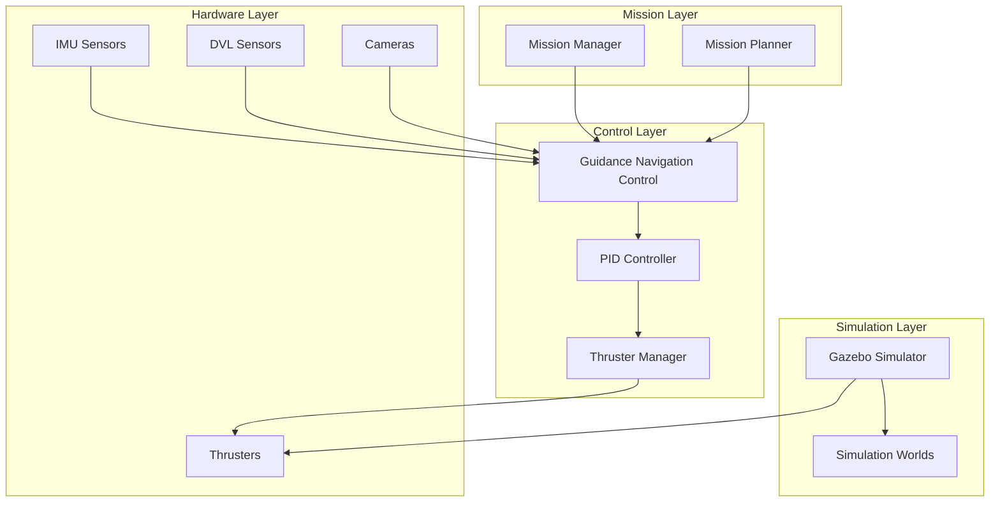

# System Architecture

The RS-ModCubes system is built on a modular, scalable architecture designed for underwater robotics applications. This document provides a comprehensive overview of the system's technical architecture, component interactions, and design principles.

## Overview

The ModCube system follows a distributed architecture pattern with clear separation of concerns across multiple ROS packages. Each package serves a specific purpose while maintaining loose coupling with other components through well-defined interfaces.



## Core Packages

### modcube_common
**Purpose**: Core frameworks, libraries, and system-wide utilities

**Key Components**:
- **Controllers**: PID controllers, motion controllers
- **Planners**: Trajectory planners, path planners
- **State Estimation**: Navigation state processing
- **Thruster Management**: Thrust allocation and control
- **Utilities**: Common helper functions and tools

**Dependencies**:
- `roscpp`, `rospy`
- `geometry_msgs`, `sensor_msgs`
- `tf`, `tf2`
- `vision_msgs`
- `modcube_msgs`

### modcube_mission
**Purpose**: Mission-specific code and high-level system orchestration

**Key Components**:
- **Mission Manager**: Central mission coordination
- **Task Execution**: Individual task handlers
- **System Launch**: Configurable system startup
- **Mission Planning**: High-level mission planning algorithms

**Features**:
- Configurable launch system with `model_name` and `simulated` parameters
- Integration with simulator and vehicle-specific components
- Mission state management and monitoring

### modcube_vehicle
**Purpose**: Vehicle-specific hardware drivers and configurations

**Key Components**:
- **IMU Manager**: Inertial measurement unit data processing
- **Depth Sensor**: Blue Robotics depth sensor integration
- **Actuators**: Pololu Maestro PWM module control for thrusters
- **Joint State Publisher**: Default joint state publishing
- **Static Transforms**: Static transform broadcasting

**Supported Hardware**:
- Xsens IMU systems
- Teledyne DVL systems
- Blue Robotics depth sensors
- Pololu Maestro PWM controllers

### modcube_msgs
**Purpose**: Custom message and service definitions

**Message Types**:
- **Sensor Data**: IMU, DVL, depth, sonar
- **Control Commands**: Thrust, servo, trajectory
- **Detection Results**: AprilTag, gate, feature detection
- **System Status**: Alarms, battery, navigation state
- **Tuning Parameters**: PID, dynamics tuning

### modcube_config
**Purpose**: System configuration and robot descriptions

**Structure**:
- **modcube_description**: Physical robot configuration
- **modcube_sim_description**: Simulation-specific configuration

**Configuration Files**:
- Thruster configurations (14-thruster setup)
- Sensor calibrations
- Control parameters
- Launch file templates

### modcube_sim
**Purpose**: Simulation environment and sensor processing

**Components**:
- Camera data processing
- Disparity to depth conversion
- Simulation-specific utilities

### modcube_sim_worlds
**Purpose**: Simulation environments and world models

**Available Worlds**:
- **Base Pool**: Basic testing environment
- **Transdec**: Complex underwater environment
- **UMD**: University of Maryland test environment

**Models**:
- Buoys and markers
- Torpedo targets
- Environmental obstacles
- Vehicle models

## Control System Architecture

### Guidance, Navigation, and Control (GNC)

The GNC system implements a hierarchical control architecture:

1. **Mission Level**: High-level mission planning and task allocation
2. **Guidance Level**: Path planning and trajectory generation
3. **Navigation Level**: State estimation and localization
4. **Control Level**: Low-level control and actuation

### PID Control Implementation

```python
# Simplified PID controller structure
class PIDController:
    def __init__(self):
        self.position_pid = PID()
        self.orientation_pid = PID()
    
    def compute_wrench(self, state, setpoint):
        # Position error calculation
        pos_error = setpoint.position - state.position
        
        # Orientation error calculation
        orient_error = self.compute_orientation_error(setpoint, state)
        
        # PID computation
        force = self.position_pid.compute(pos_error)
        torque = self.orientation_pid.compute(orient_error)
        
        return Wrench(force, torque)
```

### Thruster Allocation

The system uses a 14-thruster configuration with sophisticated allocation algorithms:

#### Thrust Allocation Matrix (TAM)

```cpp
class ThrusterManager {
public:
    // 14-thruster configuration matrix (6 DOF -> 14 thrusters)
    // Maps [Fx, Fy, Fz, Tx, Ty, Tz] to individual thruster forces
    Eigen::Matrix<double, 14, 6> allocation_matrix_;
    
    std::vector<double> allocateThrust(const geometry_msgs::Wrench& desired_wrench) {
        // Convert ROS message to Eigen vector
        Eigen::Vector6d wrench;
        wrench << desired_wrench.force.x, desired_wrench.force.y, desired_wrench.force.z,
                  desired_wrench.torque.x, desired_wrench.torque.y, desired_wrench.torque.z;
        
        // Pseudo-inverse allocation
        Eigen::VectorXd thrust_commands = allocation_matrix_.completeOrthogonalDecomposition().solve(wrench);
        
        // Apply thrust limits and saturation
        for (int i = 0; i < thrust_commands.size(); ++i) {
            thrust_commands(i) = std::clamp(thrust_commands(i), -max_thrust_, max_thrust_);
        }
        
        // Handle thruster failures
        applyFailureCompensation(thrust_commands);
        
        // Convert to std::vector
        return std::vector<double>(thrust_commands.data(), 
                                  thrust_commands.data() + thrust_commands.size());
    }
    
private:
    void applyFailureCompensation(Eigen::VectorXd& thrust_commands) {
        // Redistribute thrust if thrusters are failed
        for (int i = 0; i < failed_thrusters_.size(); ++i) {
            if (failed_thrusters_[i]) {
                thrust_commands(i) = 0.0;
                // Redistribute to healthy thrusters using optimization
                redistributeThrustLoad(i, thrust_commands);
            }
        }
    }
    
    void redistributeThrustLoad(int failed_thruster, Eigen::VectorXd& thrust_commands) {
        // Quadratic programming approach for optimal redistribution
        // Minimize: ||T||² subject to: A*T = F and thrust limits
        
        // Create modified allocation matrix without failed thruster
        Eigen::MatrixXd A_modified = allocation_matrix_;
        A_modified.row(failed_thruster).setZero();
        
        // Solve constrained optimization problem
        // Implementation details depend on chosen QP solver
    }
};
```

#### Dynamic Reconfiguration

```cpp
void ThrusterManager::updateThrusterConfiguration(const ThrusterConfig& config) {
    // Update thruster positions and orientations
    for (size_t i = 0; i < config.thrusters.size(); ++i) {
        thruster_positions_[i] = config.thrusters[i].position;
        thruster_orientations_[i] = config.thrusters[i].orientation;
    }
    
    // Recompute allocation matrix
    computeAllocationMatrix();
    
    // Update thrust limits
    max_thrust_ = config.max_thrust;
    
    ROS_INFO("Thruster configuration updated");
}

void ThrusterManager::computeAllocationMatrix() {
    allocation_matrix_.setZero();
    
    for (int i = 0; i < num_thrusters_; ++i) {
        Eigen::Vector3d pos = thruster_positions_[i];
        Eigen::Vector3d dir = thruster_orientations_[i];
        
        // Force contribution (columns 0-2)
        allocation_matrix_.block<1, 3>(i, 0) = dir.transpose();
        
        // Torque contribution (columns 3-5)
        Eigen::Vector3d torque = pos.cross(dir);
        allocation_matrix_.block<1, 3>(i, 3) = torque.transpose();
    }
}
```

## Trajectory Generation and Path Planning

### Minimum Snap Trajectory Optimization

```cpp
class DroneTrajectory {
public:
    bool solve(const std::vector<TrajectoryWaypoint>& waypoints, 
               double aggressiveness = 0.5,
               const Eigen::Vector3d& start_vel = Eigen::Vector3d::Zero(),
               const Eigen::Vector3d& end_vel = Eigen::Vector3d::Zero()) {
        
        int n_segments = waypoints.size() - 1;
        int n_coeffs = 8;  // 7th order polynomials
        
        // Time allocation
        std::vector<double> segment_times = allocateTime(waypoints, aggressiveness);
        
        // Setup optimization problem
        // Minimize: ∫ ||d⁴r/dt⁴||² dt (snap minimization)
        // Subject to: waypoint constraints, continuity constraints
        
        Eigen::MatrixXd Q = computeSnapCostMatrix(segment_times);
        Eigen::MatrixXd A = computeConstraintMatrix(waypoints, segment_times);
        Eigen::VectorXd b = computeConstraintVector(waypoints, start_vel, end_vel);
        
        // Solve quadratic program: min 0.5*x'*Q*x subject to A*x = b
        Eigen::VectorXd coefficients = solveQP(Q, A, b);
        
        // Store trajectory coefficients
        storeTrajectoryCoefficients(coefficients, segment_times, n_segments, n_coeffs);
        
        return true;
    }
    
    Eigen::Vector3d getPosition(double t) const {
        int segment = findSegment(t);
        double t_local = t - segment_start_times_[segment];
        
        Eigen::Vector3d position = Eigen::Vector3d::Zero();
        for (int i = 0; i < 8; ++i) {
            position += coefficients_[segment].block<3, 1>(0, i) * std::pow(t_local, i);
        }
        return position;
    }
    
    Eigen::Vector3d getVelocity(double t) const {
        int segment = findSegment(t);
        double t_local = t - segment_start_times_[segment];
        
        Eigen::Vector3d velocity = Eigen::Vector3d::Zero();
        for (int i = 1; i < 8; ++i) {
            velocity += i * coefficients_[segment].block<3, 1>(0, i) * std::pow(t_local, i-1);
        }
        return velocity;
    }
    
    Eigen::Vector3d getAcceleration(double t) const {
        int segment = findSegment(t);
        double t_local = t - segment_start_times_[segment];
        
        Eigen::Vector3d acceleration = Eigen::Vector3d::Zero();
        for (int i = 2; i < 8; ++i) {
            acceleration += i * (i-1) * coefficients_[segment].block<3, 1>(0, i) * std::pow(t_local, i-2);
        }
        return acceleration;
    }
    
private:
    std::vector<double> allocateTime(const std::vector<TrajectoryWaypoint>& waypoints, 
                                    double aggressiveness) {
        std::vector<double> times;
        
        for (size_t i = 1; i < waypoints.size(); ++i) {
            Eigen::Vector3d diff = waypoints[i].position - waypoints[i-1].position;
            double distance = diff.norm();
            
            // Heuristic time allocation based on distance and aggressiveness
            double base_time = distance / (2.0 * aggressiveness + 0.5);
            times.push_back(std::max(base_time, 0.5));  // Minimum 0.5s per segment
        }
        
        return times;
    }
    
    Eigen::MatrixXd computeSnapCostMatrix(const std::vector<double>& times) {
        int n_segments = times.size();
        int n_coeffs = 8;
        int total_vars = n_segments * n_coeffs * 3;  // 3D trajectory
        
        Eigen::MatrixXd Q = Eigen::MatrixXd::Zero(total_vars, total_vars);
        
        for (int seg = 0; seg < n_segments; ++seg) {
            double T = times[seg];
            
            // Snap cost matrix for 7th order polynomial
            Eigen::MatrixXd Q_seg = Eigen::MatrixXd::Zero(n_coeffs, n_coeffs);
            
            for (int i = 4; i < n_coeffs; ++i) {
                for (int j = 4; j < n_coeffs; ++j) {
                    if (i + j >= 7) {
                        double coeff = factorial(i) * factorial(j) / 
                                      (factorial(i-4) * factorial(j-4) * (i + j - 7));
                        Q_seg(i, j) = coeff * std::pow(T, i + j - 7);
                    }
                }
            }
            
            // Place in global matrix for each dimension
            for (int dim = 0; dim < 3; ++dim) {
                int offset = (seg * 3 + dim) * n_coeffs;
                Q.block(offset, offset, n_coeffs, n_coeffs) = Q_seg;
            }
        }
        
        return Q;
    }
};
```

### A* Path Planning

```cpp
class PathPlanner {
public:
    struct Node {
        Eigen::Vector3i grid_pos;
        Eigen::Vector3d world_pos;
        double g_cost;  // Cost from start
        double h_cost;  // Heuristic cost to goal
        double f_cost;  // Total cost
        std::shared_ptr<Node> parent;
        
        bool operator<(const Node& other) const {
            return f_cost > other.f_cost;  // For min-heap
        }
    };
    
    std::vector<Eigen::Vector3d> planPath(const Eigen::Vector3d& start,
                                         const Eigen::Vector3d& goal,
                                         const nav_msgs::OccupancyGrid& map) {
        // Convert world coordinates to grid coordinates
        Eigen::Vector3i start_grid = worldToGrid(start, map);
        Eigen::Vector3i goal_grid = worldToGrid(goal, map);
        
        // Initialize open and closed sets
        std::priority_queue<Node> open_set;
        std::unordered_set<Eigen::Vector3i, Vector3iHash> closed_set;
        
        // Start node
        Node start_node;
        start_node.grid_pos = start_grid;
        start_node.world_pos = start;
        start_node.g_cost = 0.0;
        start_node.h_cost = heuristic(start_grid, goal_grid);
        start_node.f_cost = start_node.g_cost + start_node.h_cost;
        start_node.parent = nullptr;
        
        open_set.push(start_node);
        
        while (!open_set.empty()) {
            Node current = open_set.top();
            open_set.pop();
            
            // Check if goal reached
            if (current.grid_pos == goal_grid) {
                return reconstructPath(current);
            }
            
            closed_set.insert(current.grid_pos);
            
            // Explore neighbors (26-connectivity in 3D)
            for (int dx = -1; dx <= 1; ++dx) {
                for (int dy = -1; dy <= 1; ++dy) {
                    for (int dz = -1; dz <= 1; ++dz) {
                        if (dx == 0 && dy == 0 && dz == 0) continue;
                        
                        Eigen::Vector3i neighbor_grid = current.grid_pos + Eigen::Vector3i(dx, dy, dz);
                        
                        // Check bounds and obstacles
                        if (!isValidCell(neighbor_grid, map) || 
                            closed_set.count(neighbor_grid)) {
                            continue;
                        }
                        
                        // Calculate costs
                        double movement_cost = std::sqrt(dx*dx + dy*dy + dz*dz);
                        double tentative_g = current.g_cost + movement_cost;
                        
                        Node neighbor;
                        neighbor.grid_pos = neighbor_grid;
                        neighbor.world_pos = gridToWorld(neighbor_grid, map);
                        neighbor.g_cost = tentative_g;
                        neighbor.h_cost = heuristic(neighbor_grid, goal_grid);
                        neighbor.f_cost = neighbor.g_cost + neighbor.h_cost;
                        neighbor.parent = std::make_shared<Node>(current);
                        
                        open_set.push(neighbor);
                    }
                }
            }
        }
        
        return {};  // No path found
    }
    
private:
    double heuristic(const Eigen::Vector3i& a, const Eigen::Vector3i& b) {
        // Euclidean distance heuristic
        Eigen::Vector3i diff = a - b;
        return std::sqrt(diff.x()*diff.x() + diff.y()*diff.y() + diff.z()*diff.z());
    }
    
    std::vector<Eigen::Vector3d> reconstructPath(const Node& goal_node) {
        std::vector<Eigen::Vector3d> path;
        std::shared_ptr<Node> current = std::make_shared<Node>(goal_node);
        
        while (current != nullptr) {
            path.push_back(current->world_pos);
            current = current->parent;
        }
        
        std::reverse(path.begin(), path.end());
        return path;
    }
};
```

## State Estimation

### Extended Kalman Filter (EKF) Implementation

The core state estimation uses a 15-state Extended Kalman Filter:

**State Vector (15 elements)**:
```
x = [px, py, pz,           # Position (3)
     vx, vy, vz,           # Velocity (3)
     ax, ay, az,           # Acceleration (3)
     φ, θ, ψ,             # Euler angles (3)
     ωx, ωy, ωz]          # Angular velocity (3)
```

**Process Model**:
```cpp
// Simplified process model
void Ekf::predict(double dt) {
    // Position integration
    state_.segment<3>(0) += state_.segment<3>(3) * dt + 0.5 * state_.segment<3>(6) * dt * dt;
    
    // Velocity integration
    state_.segment<3>(3) += state_.segment<3>(6) * dt;
    
    // Orientation integration (using angular velocity)
    Eigen::Vector3d euler_rates = computeEulerRates(state_.segment<3>(9), state_.segment<3>(12));
    state_.segment<3>(9) += euler_rates * dt;
    
    // Wrap angles
    wrapAngles();
    
    // Covariance prediction
    Eigen::MatrixXd F = computeJacobianF(dt);
    Eigen::MatrixXd Q = process_noise_cov_;
    covariance_ = F * covariance_ * F.transpose() + Q;
}
```

### Multi-Sensor Fusion Architecture

#### IMU Integration
```cpp
void Ekf::updateImu(const Eigen::Vector3d& accel, 
                    const Eigen::Vector3d& gyro,
                    const Eigen::Vector4d* orientation) {
    // Acceleration measurement model
    Eigen::Vector3d h_accel = state_.segment<3>(6);  // Expected acceleration
    Eigen::Vector3d innovation_accel = accel - h_accel;
    
    // Angular velocity measurement model
    Eigen::Vector3d h_gyro = state_.segment<3>(12);  // Expected angular velocity
    Eigen::Vector3d innovation_gyro = gyro - h_gyro;
    
    // Measurement Jacobian
    Eigen::MatrixXd H = computeImuJacobian();
    
    // Kalman update
    performKalmanUpdate(H, innovation_accel, imu_noise_cov_);
    performKalmanUpdate(H, innovation_gyro, gyro_noise_cov_);
    
    // Optional orientation update
    if (orientation) {
        updateOrientation(*orientation);
    }
}
```

#### DVL Integration
```cpp
void Ekf::updateDvl(const Eigen::Vector3d& velocity, double altitude) {
    // Transform DVL velocity to world frame
    Eigen::Matrix3d R = getRotationMatrix();
    Eigen::Vector3d velocity_world = R * velocity;
    
    // Velocity measurement model
    Eigen::Vector3d h_vel = state_.segment<3>(3);  // Expected velocity
    Eigen::Vector3d innovation = velocity_world - h_vel;
    
    // Measurement Jacobian
    Eigen::MatrixXd H = computeDvlJacobian();
    
    // Kalman update
    performKalmanUpdate(H, innovation, dvl_noise_cov_);
    
    // Altitude constraint (if available)
    if (altitude > 0) {
        updateAltitude(altitude);
    }
}
```

#### Depth Sensor Integration
```cpp
void Ekf::updateDepth(double depth) {
    // Depth measurement model (z-position)
    double h_depth = state_(2);  // Expected depth
    double innovation = depth - h_depth;
    
    // Simple measurement Jacobian (1x15)
    Eigen::MatrixXd H = Eigen::MatrixXd::Zero(1, 15);
    H(0, 2) = 1.0;  // ∂h/∂z = 1
    
    // Kalman update
    Eigen::MatrixXd R = Eigen::MatrixXd::Identity(1, 1) * depth_noise_var_;
    performKalmanUpdate(H, Eigen::VectorXd::Constant(1, innovation), R);
}
```

### Visual Odometry Integration

```cpp
class VisualOdometry {
public:
    struct PoseEstimate {
        Eigen::Vector3d position;
        Eigen::Quaterniond orientation;
        Eigen::Matrix6d covariance;
        double confidence;
        ros::Time timestamp;
    };
    
    PoseEstimate processFrame(const cv::Mat& image, ros::Time timestamp) {
        // Feature detection and matching
        std::vector<cv::KeyPoint> keypoints;
        cv::Mat descriptors;
        detector_->detectAndCompute(image, cv::noArray(), keypoints, descriptors);
        
        // Match with previous frame
        std::vector<cv::DMatch> matches;
        if (!prev_descriptors_.empty()) {
            matcher_->match(prev_descriptors_, descriptors, matches);
            
            // Filter good matches
            std::vector<cv::DMatch> good_matches;
            filterMatches(matches, good_matches);
            
            // Estimate motion
            if (good_matches.size() >= min_features_) {
                return estimateMotion(prev_keypoints_, keypoints, good_matches);
            }
        }
        
        // Store for next iteration
        prev_keypoints_ = keypoints;
        prev_descriptors_ = descriptors.clone();
        
        return PoseEstimate{};  // Invalid estimate
    }
    
private:
    PoseEstimate estimateMotion(const std::vector<cv::KeyPoint>& prev_kpts,
                               const std::vector<cv::KeyPoint>& curr_kpts,
                               const std::vector<cv::DMatch>& matches) {
        // Extract matched points
        std::vector<cv::Point2f> prev_pts, curr_pts;
        for (const auto& match : matches) {
            prev_pts.push_back(prev_kpts[match.queryIdx].pt);
            curr_pts.push_back(curr_kpts[match.trainIdx].pt);
        }
        
        // Estimate essential matrix
        cv::Mat E, mask;
        E = cv::findEssentialMat(prev_pts, curr_pts, camera_matrix_, 
                                cv::RANSAC, 0.999, 1.0, mask);
        
        // Recover pose
        cv::Mat R, t;
        int inliers = cv::recoverPose(E, prev_pts, curr_pts, camera_matrix_, R, t, mask);
        
        // Convert to Eigen and compute covariance
        Eigen::Matrix3d R_eigen;
        Eigen::Vector3d t_eigen;
        cv::cv2eigen(R, R_eigen);
        cv::cv2eigen(t, t_eigen);
        
        // Estimate covariance based on inlier ratio and feature quality
        double confidence = static_cast<double>(inliers) / matches.size();
        Eigen::Matrix6d covariance = computePoseCovariance(confidence, inliers);
        
        PoseEstimate estimate;
        estimate.position = t_eigen;
        estimate.orientation = Eigen::Quaterniond(R_eigen);
        estimate.covariance = covariance;
        estimate.confidence = confidence;
        estimate.timestamp = ros::Time::now();
        
        return estimate;
    }
};
```

### Navigation State

The comprehensive navigation state includes:

```cpp
struct NavigationState {
    // Kinematic state
    Eigen::Vector3d position;           // [x, y, z] in world frame
    Eigen::Vector3d velocity;           // [vx, vy, vz] in world frame
    Eigen::Vector3d acceleration;       // [ax, ay, az] in world frame
    
    // Orientation state
    Eigen::Vector3d euler_angles;       // [roll, pitch, yaw]
    Eigen::Quaterniond quaternion;      // Orientation quaternion
    Eigen::Vector3d angular_velocity;   // [ωx, ωy, ωz] in body frame
    
    // Uncertainty quantification
    Eigen::Matrix<double, 15, 15> covariance;  // Full state covariance
    
    // Quality metrics
    double position_accuracy;           // Position estimate accuracy (m)
    double orientation_accuracy;        // Orientation estimate accuracy (rad)
    double velocity_accuracy;           // Velocity estimate accuracy (m/s)
    
    // Sensor health
    bool imu_healthy;
    bool dvl_healthy;
    bool depth_healthy;
    bool vision_healthy;
    
    // Timestamps
    ros::Time timestamp;
    ros::Time last_imu_update;
    ros::Time last_dvl_update;
    ros::Time last_depth_update;
    ros::Time last_vision_update;
};
```

## Communication Architecture

### ROS Topics

**Control Topics**:
- `/modcube/controller_command`: Control commands
- `/modcube/nav_state`: Navigation state
- `/modcube/thrust`: Thruster commands

**Sensor Topics**:
- `/modcube/imu`: IMU data
- `/modcube/dvl`: DVL data
- `/modcube/depth`: Depth measurements

**Mission Topics**:
- `/modcube/mission_state`: Mission status
- `/modcube/task_command`: Task commands

### ROS Services

**Configuration Services**:
- `set_pid_params`: PID parameter tuning
- `set_thruster_config`: Thruster configuration
- `mission_control`: Mission management

## Simulation Integration

### Gazebo Integration

The system integrates with Gazebo through:

- **UUV Simulator**: Underwater vehicle dynamics
- **Custom Plugins**: ModCube-specific functionality
- **Sensor Simulation**: Realistic sensor modeling
- **Environmental Modeling**: Underwater physics simulation

### Hardware-in-the-Loop (HIL)

Support for HIL testing:
- Real hardware integration with simulated environment
- Sensor data injection
- Actuator command forwarding

## Performance Characteristics

### Real-time Performance

- **Control Loop**: 100 Hz update rate
- **State Estimation**: 50 Hz update rate
- **Mission Planning**: 10 Hz update rate

### Scalability

- **Multi-vehicle Support**: Distributed architecture
- **Modular Expansion**: Plugin-based component addition
- **Resource Management**: Efficient CPU and memory usage

## Security and Safety

### Safety Systems

- **Alarm System**: Real-time fault detection
- **Emergency Procedures**: Automatic safety responses
- **Redundancy**: Critical system backup mechanisms

### Data Security

- **Secure Communication**: Encrypted data transmission
- **Access Control**: Role-based system access
- **Data Logging**: Comprehensive system monitoring

## Development Guidelines

### Code Organization

- **Package Structure**: Clear separation of concerns
- **Interface Design**: Well-defined APIs
- **Documentation**: Comprehensive code documentation

### Testing Strategy

- **Unit Testing**: Component-level testing
- **Integration Testing**: System-level validation
- **Simulation Testing**: Virtual environment validation
- **Hardware Testing**: Real-world validation

### Version Control

- **Git Workflow**: Feature branch development
- **Release Management**: Semantic versioning
- **Continuous Integration**: Automated testing and deployment

## Future Enhancements

### Planned Features

- **Machine Learning Integration**: AI-based control and planning
- **Advanced Sensor Fusion**: Multi-modal state estimation
- **Swarm Coordination**: Multi-vehicle collaboration
- **Cloud Integration**: Remote monitoring and control

### Research Directions

- **Adaptive Control**: Self-tuning control systems
- **Fault Tolerance**: Advanced fault detection and recovery
- **Energy Optimization**: Efficient power management
- **Autonomous Decision Making**: High-level autonomy

This architecture provides a robust foundation for underwater robotics research and applications, with clear pathways for future enhancement and expansion.