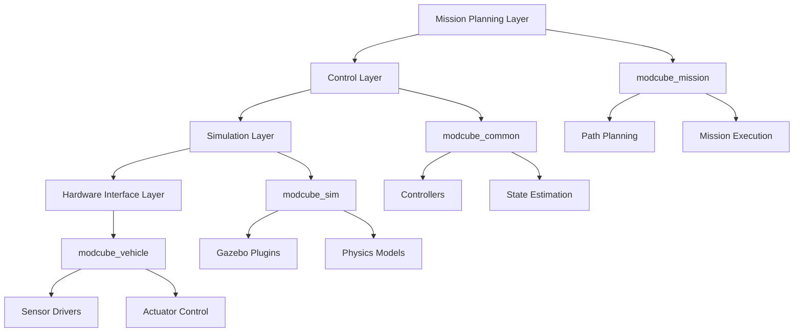

# RS-ModCubes: Self-Reconfigurable Modular Underwater Robots

[](http://wiki.ros.org/)
[](LICENSE)
[](https://github.com/your-repo/actions)
[](https://doi.org/10.1109/LRA.2025.3543139)

## Project Overview

**RS-ModCubes** is a comprehensive simulation, control, and mission planning framework for self-reconfigurable, scalable modular underwater robots. The system can simulate and control multiple cubic robot modules that can autonomously reconfigure to form different configurations for various underwater operations.

### Core Features

- **Modular Self-Reconfiguration**: Dynamic configuration adaptation during missions
- **Underwater Physics Simulation**: Comprehensive hydrodynamic modeling based on Gazebo
- **Mission Planning**: Autonomous navigation and mission execution
- **Teleoperation Support**: Real-time human-robot interaction
- **Multi-Robot Coordination**: Scalable swarm behavior implementation
- **Extensible Framework**: ROS-based modular architecture

## System Architecture

### Overall Architecture Diagram



### Package Structure Analysis

#### Core Framework Packages

| Package Name | Functionality | Main Components |
|--------------|---------------|----------------|
| **`modcube_common`** | Core utilities and shared libraries | Controllers, planners, state estimation, dynamics |
| **`modcube_config`** | Configuration files and robot descriptions | URDF models, parameter files, launch configurations |
| **`modcube_mission`** | Mission execution and teleoperation | Mission planning, teleoperation interface, system launch files |
| **`modcube_msgs`** | Custom ROS message definitions | Inter-module communication protocols |

#### Simulation Packages

| Package Name | Functionality | Main Components |
|--------------|---------------|----------------|
| **`modcube_sim`** | Gazebo simulation interface | Simulation launch files, environment setup |
| **`modcube_sim_gazebo_plugins`** | Custom Gazebo plugins | Thruster dynamics, navigation state, sensor models |
| **`modcube_sim_worlds`** | Simulation environments | Underwater worlds, obstacle courses, test scenarios |

#### Hardware Interface

| Package Name | Functionality | Main Components |
|--------------|---------------|----------------|
| **`modcube_vehicle`** | Vehicle-specific hardware drivers | IMU, thrusters, sensors, actuator control |

#### Dependencies

| Package Name | Functionality | Main Components |
|--------------|---------------|----------------|
| **`uuv_simulator`** | UUV simulation framework | Hydrodynamic models, sensor plugins, control algorithms |

## Technical Implementation Details

### 1. Control System

#### PID Controller Implementation
- **Position Control**: 6-DOF PID controller supporting position and attitude control
- **Thruster Allocation**: Force allocation algorithm based on thruster configuration matrix
- **Dynamics Compensation**: Model-based feedforward control

```python
# PID Controller Core Implementation
class PIDController:
    def __init__(self, kp, ki, kd):
        self.kp = kp
        self.ki = ki
        self.kd = kd
        self.prev_error = 0
        self.integral = 0

    def compute(self, error, dt):
        self.integral += error * dt
        derivative = (error - self.prev_error) / dt if dt > 0 else 0
        output = self.kp * error + self.ki * self.integral + self.kd * derivative
        self.prev_error = error
        return output
```

#### Thruster Management
- **Thruster Configuration**: Support for 8-thruster and 32-thruster configurations
- **Force Allocation Matrix**: Automatic calculation of Thruster Allocation Matrix (TAM)
- **Fault Handling**: Thruster fault detection and compensation

### 2. State Estimation

#### Sensor Fusion
- **IMU Data Processing**: Xsens IMU data fusion
- **DVL Velocity Estimation**: Teledyne DVL Doppler velocity measurement
- **Depth Sensor**: Pressure sensor depth measurement
- **Extended Kalman Filter**: EKF state estimation implementation

### 3. Mission Planning

#### Trajectory Generation
- **Minimum Snap Trajectory**: Smooth trajectory generation algorithm
- **Path Following**: PID-based path following control
- **Obstacle Avoidance**: Dynamic obstacle avoidance planning

#### Mission Management
- **Task Scheduling**: State machine-based task execution
- **Resource Management**: Sensor and actuator resource allocation
- **Fault Recovery**: Mission failure handling and recovery mechanisms

### 4. Simulation Environment

#### Physics Modeling
- **Hydrodynamics**: Underwater dynamics based on Fossen model
- **Thruster Model**: T200 thruster dynamics simulation
- **Sensor Simulation**: IMU, DVL, camera and other sensor simulations

#### Environment Models
- **Underwater Scenes**: Various underwater environment models
- **Mission Props**: Gates, buoys, targets and other mission-related models
- **Current Simulation**: Ocean current and disturbance simulation

## Configuration System

### Robot Configuration

#### Single Module Configuration (default.xacro)
- 8-thruster configuration
- Basic sensor suite
- Standard control parameters

#### Four Module Configuration (default_4_modcube.xacro)
- 32-thruster configuration
- Enhanced sensor suite
- Multi-module coordinated control

### Parameter Configuration Files

#### Control Parameters (controller.yaml)
```yaml
controller:
  kp: [1.0, 1.0, 1.0, 1.0, 1.0, 1.0]
  ki: [0.1, 0.1, 0.1, 0.1, 0.1, 0.1]
  kd: [0.01, 0.01, 0.01, 0.01, 0.01, 0.01]
  max_wrench: [100, 100, 100, 50, 50, 50]
```

#### Thruster Configuration (thruster_manager.yaml)
```yaml
frequency: 50
thruster_ids: [0, 1, 2, 3, 4, 5, 6, 7]
```

## Usage Guide

### Quick Start

#### 1. Environment Setup
```bash
# Install ROS dependencies
sudo apt-get install ros-$ROS_DISTRO-gazebo-*
sudo apt-get install ros-$ROS_DISTRO-uuv-simulator

# Clone project
git clone https://github.com/your-username/ModCube.git
cd ModCube

# Build workspace
catkin build
source devel/setup.bash
```

#### 2. Launch Simulation
```bash
# Launch basic simulation
roslaunch modcube_sim kingfisher_umd_sim.launch

# Launch multi-robot simulation
roslaunch modcube_sim multi_robot_sim.launch num_robots:=4
```

#### 3. Mission Execution
```bash
# Launch teleoperation interface
roslaunch modcube_mission teleop_mission.launch

# Launch autonomous mission
roslaunch modcube_mission autonomous_mission.launch mission_file:=sample_mission.yaml
```

#### 4. Navigation Commands
```bash
# Set navigation target
rostopic pub /modcube/goto geometry_msgs/PoseStamped "
header:
  frame_id: 'world'
pose:
  position: {x: 2.0, y: 2.0, z: 2.0}
  orientation: {x: 0.0, y: 0.0, z: 0.0, w: 1.0}"

# Or use simplified command
goto 2 2 2 1 1 1 1
```

### Advanced Configuration

#### Custom Robot Configuration
```bash
# Edit robot description
roscd modcube_config/modcube_sim_description/urdf/
# Modify default.xacro for single robot
# Modify default_4_modcube.xacro for four-module configuration
```

#### Mission Planning Configuration
```yaml
# sample_mission.yaml
mission:
  name: "exploration_mission"
  waypoints:
    - {x: 0, y: 0, z: 0}
    - {x: 5, y: 0, z: -2}
    - {x: 5, y: 5, z: -2}
  tasks:
    - type: "survey"
      duration: 30
    - type: "sample_collection"
      target: "object_1"
```

#### Control Parameter Tuning
```bash
# View current parameters
rosparam list /modcube/

# Set PID gains
rosparam set /modcube/controller/pid_gains/kp 1.0
rosparam set /modcube/controller/pid_gains/ki 0.1
rosparam set /modcube/controller/pid_gains/kd 0.01
```

## Testing and Validation

### Unit Testing
```bash
# Run all tests
catkin run_tests

# Run specific package tests
catkin run_tests modcube_common
```

### Simulation Validation
```bash
# Test basic functionality
rostest modcube_sim basic_simulation.test

# Test multi-robot scenarios
rostest modcube_sim multi_robot.test
```

## Performance Metrics

The framework has been validated with the following performance characteristics:

- **Real-time Factor**: 0.8-1.0 (depending on system configuration)
- **Control Frequency**: 50-100 Hz
- **Simulation Accuracy**: Hydrodynamic force error <5%
- **Multi-robot Scalability**: Tested with up to 8 robots running simultaneously

## Development Guide

### Code Standards
- Follow ROS C++ style guide
- Use `clang-format` for code formatting
- Include comprehensive unit tests
- Document public APIs using Doxygen

### Contribution Guidelines
1. Fork the project repository
2. Create a feature branch
3. Commit your changes
4. Create a Pull Request

## Citation

If you use RS-ModCubes in your research, please cite our work:

```bibtex
@article{zheng2025rs,
  title={Rs-modcubes: Self-reconfigurable, scalable, modular cubic robots for underwater operations},
  author={Zheng, Jiaxi and Dai, Guangmin and He, Botao and Mu, Zhaoyang and Meng, Zhaochen and Zhang, Tianyi and Zhi, Weiming and Fan, Dixia},
  journal={IEEE Robotics and Automation Letters},
  year={2025},
  publisher={IEEE}
}
```

## License

This project is licensed under the MIT License - see the [LICENSE](LICENSE) file for details.

## Acknowledgments

- CMU TartanAUV team for the base Kingfisher framework
- UUV Simulator community for underwater simulation tools
- ROS community for robotics middleware

## Related Projects

- [UUV Simulator](https://github.com/uuvsimulator/uuv_simulator)
- [TartanAUV](https://www.tartanauv.com/)
- [ROS](https://www.ros.org/)
- [Gazebo](http://gazebosim.org/)

---

**If you find this project useful, please consider giving it a star!**